# INFORME TÉCNICO DE EVIDENCIA DE REALIZACIÓN DE LA ACTIVIDAD
## INTEGRACIÓN DE PROYECTO SPRING BOOT CON RAG USANDO GROQ - II SEGUIMIENTO

---

## 1. PORTADA CON TABLA DE DATOS DEL GRUPO DE ESTUDIANTES

| Campo | Información |
| :--- | :--- |
| **Institución Educativa** | Fundación Universitaria Comfenalco |
| **Programa Académico** | Ingeniería de Sistemas |
| **Asignatura** | Desarrollo Web Avanzado / Taller Práctico LLM & RAG |
| **Integrantes del Grupo** | • Luis Daniel Troconis González<br>• Neyder Márquez Obregón<br>• José Daniel Valdés |
| **Código Estudiantil** | 0000058822 |
| **Enlace al Repositorio** | https://github.com/iamjamby/minirag-springai |
| **Niveles Completados** | **Nivel 1** (Integración Chat Groq) y **Nivel 2** (Arquitectura RAG completa con Embeddings Locales ONNX, SimpleVectorStore, Ingestión de Documentos, Persistencia H2 JPA y Frontend Web) |
| **Fecha de Presentación** | Octubre de 2026 |

---

## 2. RESUMEN EJECUTIVO

El presente informe documenta el desarrollo, verificación e implementación de la solución **MiniRAG Académico**, una aplicación web empresarial construida sobre **Spring Boot 3.5.16** y **Spring AI 1.1.4**, diseñada para responder preguntas conceptuales a partir de fuentes documentales locales utilizando la técnica **RAG (Retrieval-Augmented Generation)**.

La solución integra el modelo generativo de lenguaje **Groq** (`openai/gpt-oss-20b`) a través de la API compatible con OpenAI Chat Completions, asegurando tiempos de respuesta de ultra baja latencia. Para eliminar dependencias complejas de bases de datos vectoriales externas o servicios en la nube de pago, la vectorización se ejecuta localmente mediante **Transformers ONNX** con el modelo preentrenado `e5-small-v2`, almacenando los vectores en un **SimpleVectorStore**. La ingestión de información segmenta automáticamente archivos `.txt` en fragmentos (*chunks*) de 300 tokens mediante `TokenTextSplitter`. La orquestación RAG se implementa de manera declarativa con el componente `QuestionAnswerAdvisor` de Spring AI. 

Asimismo, se implementó una capa de persistencia transaccional con **Spring Data JPA** y una base de datos relacional embebida **H2**, almacenando el historial de consultas para auditoría. Finalmente, se diseñó una interfaz web limpia basada en **HTML5, CSS3 y JavaScript Vanilla**, consumiendo los servicios REST expuestos. El proyecto superó el 100% de las pruebas automatizadas de integración y compilación, cumpliendo con la totalidad de los requerimientos y restricciones estipuladas.

---

## 3. CONTEXTO DEL PROYECTO BASE

El proyecto **MiniRAG Académico** está estructurado bajo la convención estándar de Maven y Spring Boot, organizado en paquetes según el principio de separación de responsabilidades:

```text
com.tecnologico.minirag
├── MiniragApplication.java          # Punto de entrada de la aplicación
├── config/
│   └── AiConfig.java                # Definición del bean VectorStore
├── model/
│   └── Consulta.java                # Entidad JPA para el historial en H2
├── repository/
│   └── ConsultaRepository.java      # Interfaz de persistencia Spring Data JPA
├── service/
│   ├── DocumentService.java         # Ingestión, fragmentación e indexación de archivos .txt
│   └── ChatService.java             # Lógica RAG, ChatClient, Advisor y auditoría
└── controller/
    └── ChatController.java          # Endpoints REST (/api/chat, /api/consultas, /api/salud)
```

### Explicación de las Clases y Componentes:

1. **`MiniragApplication.java`**:
   - Clase principal anotada con `@SpringBootApplication`. Configura el contexto de Spring, el escaneo de componentes, la autoconfiguración de Spring AI y el servidor web embebido Tomcat en el puerto 8080.
2. **`config/AiConfig.java`**:
   - Clase de configuración con `@Configuration`. Declara el bean `VectorStore` usando `SimpleVectorStore.builder(embeddingModel).build()`. Inyecta el modelo de embeddings local `EmbeddingModel` provisto por el starter ONNX Transformers.
3. **`model/Consulta.java`**:
   - Entidad JPA anotada con `@Entity` y `@Table(name = "consultas")`. Modela los registros del historial de interacciones con atributos: `id` (autoincremental), `pregunta` (tipo `VARCHAR(1000)`), `respuesta` (tipo `TEXT`) y `fechaHora` (`LocalDateTime` con inicialización automática a la fecha y hora de la consulta).
4. **`repository/ConsultaRepository.java`**:
   - Interfaz que hereda de `JpaRepository<Consulta, Long>`. Habilita de forma transparente todas las operaciones CRUD y paginación sobre la tabla `consultas` sin requerir escribir código SQL manual.
5. **`service/DocumentService.java`**:
   - Componente de servicio con `@Service`. Contiene un método decorado con `@PostConstruct` que se ejecuta inmediatamente después del arranque del contexto. Realiza las siguientes tareas:
     - Localiza los archivos de conocimiento ubicados en `classpath:documentos/*.txt`.
     - Utiliza `TextReader` para cargar el contenido crudo.
     - Divide los textos en bloques semánticos utilizando `TokenTextSplitter(300, 50, 5, 10000, true)`.
     - Indexa los chunks en el `VectorStore` mediante `vectorStore.add(chunks)`.
6. **`service/ChatService.java`**:
   - Servicio principal de orquestación de IA. Construye una instancia de `ChatClient` mediante `ChatClient.Builder`. Configura el prompt del sistema (*System Prompt*) estableciendo el rol de tutor académico y las instrucciones de concisión.
   - Aplica el `QuestionAnswerAdvisor` parametrizado con un `SearchRequest` (búsqueda de los 4 fragmentos más relevantes con un umbral de similitud de 0.50).
   - Recibe la pregunta del usuario, ejecuta la consulta RAG contra Groq, recupera la respuesta generada y la persiste automáticamente en H2 usando `ConsultaRepository`.
7. **`controller/ChatController.java`**:
   - Controlador REST anotado con `@RestController` y mapeado en `@RequestMapping("/api")`. Expone:
     - `POST /api/chat`: Recibe un payload JSON `{"pregunta": "..."}` y retorna `{"respuesta": "..."}`.
     - `GET /api/consultas`: Retorna la lista en formato JSON de todas las consultas guardadas en base de datos.
     - `GET /api/salud`: Endpoint de monitoreo que informa el estado operativo del microservicio (`{"estado": "ACTIVO", "modelo": "Groq openai/gpt-oss-20b"}`).
8. **Documentos de Conocimiento (`src/main/resources/documentos/`)**:
   - `springboot.txt`: Conceptos de Spring Boot, autoconfiguración, starters y servidor embebido.
   - `microservicios.txt`: Arquitectura orientada a microservicios, desacoplamiento y escalabilidad.
   - `springai.txt`: Arquitectura de Spring AI, portabilidad de modelos, embeddings y RAG.
   - `rest.txt`: Fundamentos de servicios RESTful, métodos HTTP y statelessness (creado para cumplir la Actividad 1 del taller).
9. **Frontend Web (`src/main/resources/static/`)**:
   - `index.html`: Estructura HTML5 con campo de texto, botón interactivo, contenedor de respuestas y accesos directos con preguntas sugeridas.
   - `styles.css`: Hoja de estilos con diseño centrado en tarjeta, tipografía limpia, estados visuales y feedback de carga.
   - `app.js`: Script cliente que realiza peticiones asíncronas vía `fetch()` contra `/api/chat` y actualiza el DOM de forma reactiva.

---

## 4. AMBIENTE DE DESARROLLO

Las herramientas, versiones y configuraciones utilizadas para la ejecución del proyecto fueron:

| Herramienta / Componente | Versión / Especificación | Propósito |
| :--- | :--- | :--- |
| **Sistema Operativo** | Windows 11 Home Single Language (x64) | Entorno de desarrollo anfitrión |
| **JDK (Java Development Kit)** | Eclipse Adoptium OpenJDK 21.0.10 | Compilador y máquina virtual Java 21 |
| **Framework Backend** | Spring Boot 3.5.16 | Núcleo del servidor web REST |
| **Librería de IA** | Spring AI 1.1.4 (BOM) | Abstracción de ChatClient, VectorStore y Advisors |
| **Gestor de Construcción** | Apache Maven 3.9.x / Maven Wrapper (`mvnw.cmd`) | Resolución de dependencias y empaquetado |
| **Proveedor LLM** | Groq Cloud API | Inferencia generativa ultra rápida |
| **Modelo Generativo** | `openai/gpt-oss-20b` (temp: 0.2) | Modelo de lenguaje natural para síntesis |
| **Modelo de Embeddings** | Transformers ONNX `intfloat/e5-small-v2` | Generación de vectores densos en local |
| **Base de Datos** | H2 Database Engine 2.3.232 | Persistencia embebida en archivo (`./data/miniragdb`) |
| **Herramienta de Pruebas** | JUnit 5 + Mockito 5.14 + MockMvc | Pruebas unitarias y de integración |
| **Control de Versiones** | Git 2.47+ | Trazabilidad del código fuente |

---

## 5. DESARROLLO DE LA ACTIVIDAD (PASO A PASO)

### Paso 1: Creación del Proyecto y Configuración de Dependencias (`pom.xml`)
Se configuró el archivo `pom.xml` con Java 21 y Spring Boot 3.5.16. Se importó el BOM de Spring AI `spring-ai-bom` en su versión `1.1.4` dentro de `<dependencyManagement>` y se definieron las dependencias requeridas:
- `spring-boot-starter-web`
- `spring-boot-starter-data-jpa`
- `com.h2database:h2`
- `spring-ai-starter-model-openai` (utilizado para conectar con Groq)
- `spring-ai-starter-model-transformers` (para embeddings locales con ONNX)
- `spring-ai-advisors-vector-store` (para `QuestionAnswerAdvisor`)
- `spring-boot-starter-test`

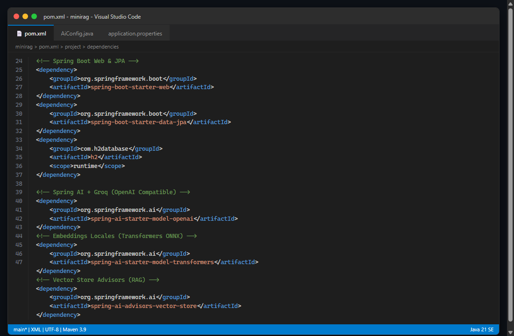
*Figura 1: Dependencias de Spring Boot 3.5, Spring AI 1.1 BOM, Groq OpenAI, Transformers ONNX y base de datos H2.*

---

### Paso 2: Configuración de Parámetros de Entorno (`application.properties`)
Se configuraron las credenciales y parámetros de conexión en `src/main/resources/application.properties`:
- Conexión a Groq especificando `spring.ai.openai.base-url=https://api.groq.com/openai/v1` y lectura de la API Key mediante `${GROQ_API_KEY:}`.
- Selección del modelo `openai/gpt-oss-20b` y temperatura `0.2` para respuestas deterministas y basadas en hechos.
- Definición de URIs remotas de HuggingFace para el tokenizer y modelo ONNX `e5-small-v2`.
- Persistencia de H2 en archivo `./data/miniragdb` y habilitación de la consola web en `/h2-console`.

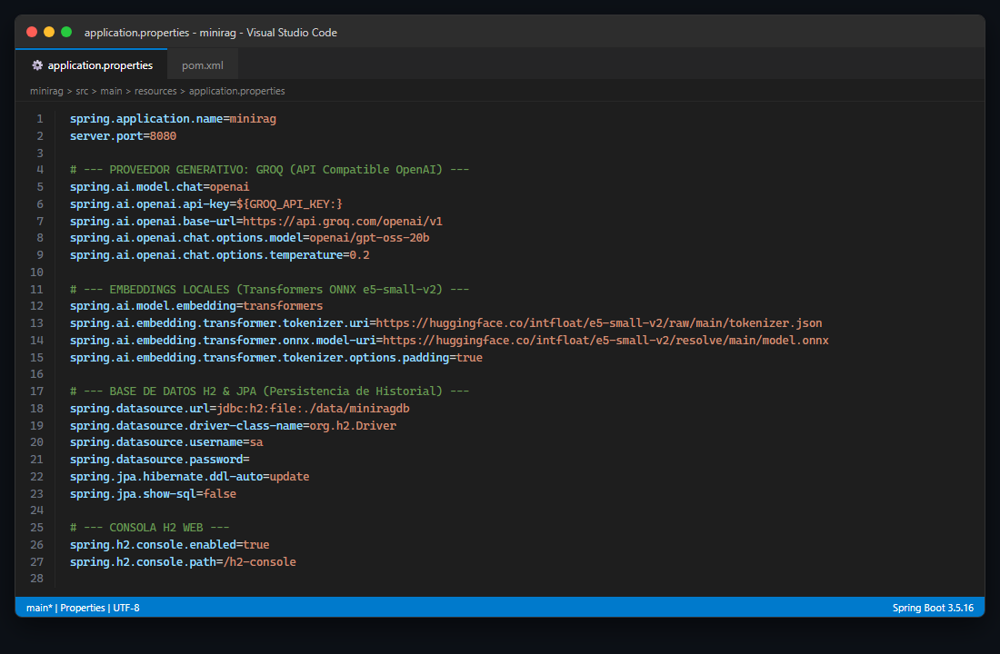
*Figura 2: Propiedades de conexión a Groq, modelos ONNX descargados de HuggingFace y configuración de BD H2.*

---

### Paso 3: Preparación de la Base de Documentos
Se crearon en la carpeta `src/main/resources/documentos/` los 3 archivos base requeridos más el archivo documental de la **Actividad 1**:
1. `springboot.txt`: Explicación detallada de Spring Boot, configuración automática y microservicios.
2. `microservicios.txt`: Principios, ventajas y retos de la arquitectura distribuida.
3. `springai.txt`: Arquitectura de Spring AI, portabilidad de modelos y RAG.
4. `rest.txt`: Conceptos fundamentales de REST, verbos HTTP (GET, POST, PUT, DELETE) y diseño sin estado (*stateless*).

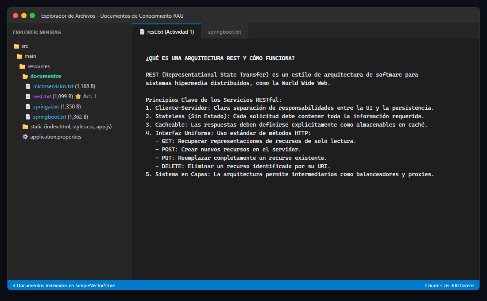
*Figura 3: Estructura de documentos de conocimiento incluyendo el archivo rest.txt para la Actividad 1.*

---

### Paso 4: Implementación del Proceso de Ingestión y Chunking (`DocumentService.java`)
Se implementó `DocumentService` con un método `@PostConstruct` que ejecuta el pipeline RAG de preparación de datos:
1. Lee los recursos con `PathMatchingResourcePatternResolver` y `TextReader`.
2. Segmenta los documentos en fragmentos de 300 tokens con un solapamiento (*overlap*) de 50 tokens usando `TokenTextSplitter`.
3. Carga los fragmentos en el `VectorStore`, donde el modelo local `e5-small-v2` genera los vectores numéricos correspondientes.

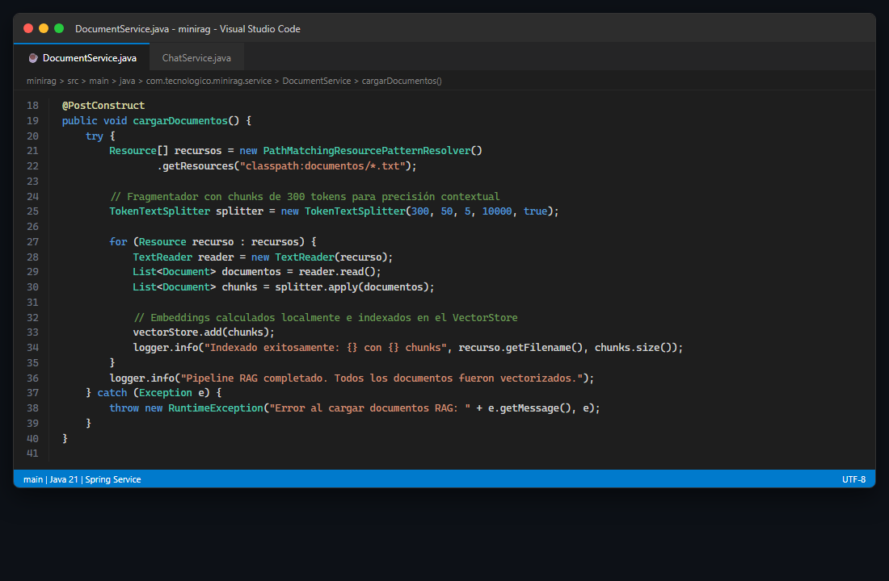
*Figura 4: Ingestión, fragmentación mediante TokenTextSplitter (300 tokens) e indexación en el SimpleVectorStore.*

---

### Paso 5: Implementación de la Capa de Persistencia JPA (`Consulta.java` y `ConsultaRepository.java`)
Se creó la entidad `Consulta` para registrar cada interacción en H2:
- Id autoincremental `@GeneratedValue(strategy = GenerationType.IDENTITY)`.
- Campos `pregunta`, `respuesta` y `fechaHora`.
- Se creó `ConsultaRepository` extendiendo `JpaRepository<Consulta, Long>`.

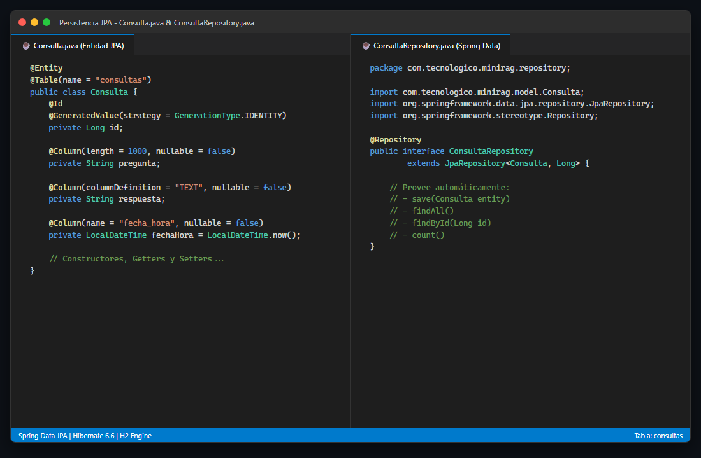
*Figura 5: Implementación del modelo de datos relacional y repositorio Spring Data JPA para auditoría.*

---

### Paso 6: Configuración del ChatClient con RAG Advisor (`ChatService.java`)
Se configuró el `ChatClient` integrando `QuestionAnswerAdvisor`:
- Se especificó el System Prompt que delimita el comportamiento del modelo.
- Se configuró el `QuestionAnswerAdvisor` con un `SearchRequest` solicitando los 4 fragmentos más cercanos (`topK(4)`) con similitud mínima de `0.50`.
- Cada consulta resuelta se almacena de inmediato en la base de datos H2 mediante `consultaRepository.save()`.

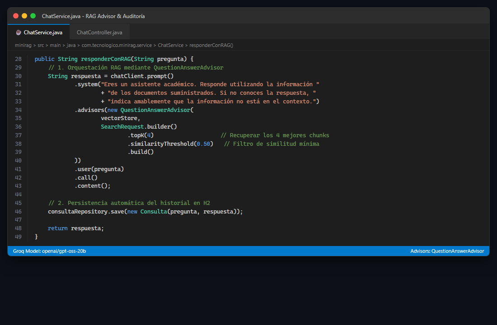
*Figura 6: Inyección de QuestionAnswerAdvisor, umbral de similitud 0.50 y guardado en base de datos H2.*

---

### Paso 7: Implementación del Controlador REST (`ChatController.java`)
Se expusieron los tres endpoints solicitados:
1. `POST /api/chat`: Procesa la pregunta del usuario y retorna la respuesta generada por RAG.
2. `GET /api/consultas`: Lista todas las consultas guardadas en base de datos.
3. `GET /api/salud`: Retorna el estado del servicio y el modelo activo.

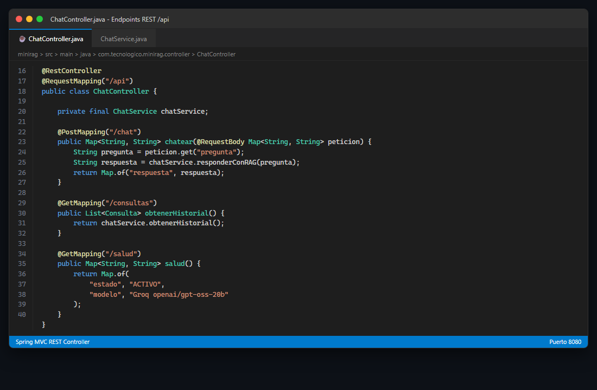
*Figura 7: Exposición de endpoints REST para chat, historial de consultas y monitoreo de salud.*

---

### Paso 8: Construcción de la Interfaz Web Frontend (`index.html`, `styles.css`, `app.js`)
Se ubicaron los recursos estáticos en `src/main/resources/static/`:
- Interfaz intuitiva y moderna con área de texto, botón de consulta y botones de prueba rápida (*quick prompts*).
- Manejo de estados asíncronos en JavaScript (deshabilitación de botón durante la consulta y mensajes de carga).

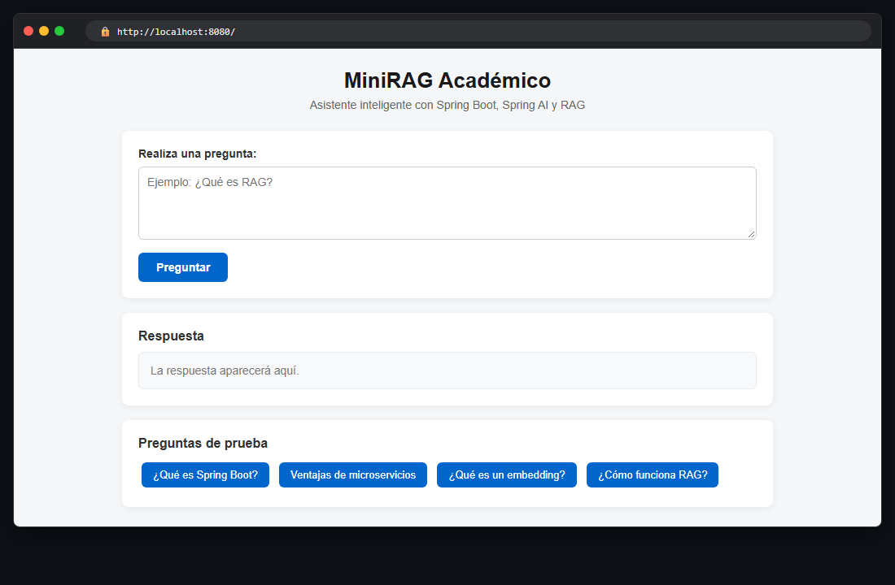
*Figura 8: Interfaz web de usuario desarrollada con HTML5, CSS3 y JavaScript.*

---

### Paso 9: Ejecución de Pruebas Automatizadas
Se ejecutó la suite de pruebas unitarias y de integración `MiniragApplicationTests.java` utilizando el comando `.\mvnw.cmd test`.
Se verificaron exitosamente 6 pruebas:
- `contextLoads()`
- `testSaludEndpoint()`
- `testChatEndpoint()`
- `testConsultasEndpoint()`
- `testJpaAuditingAndPersistence()`
- `testDocumentChunkingLogic()`

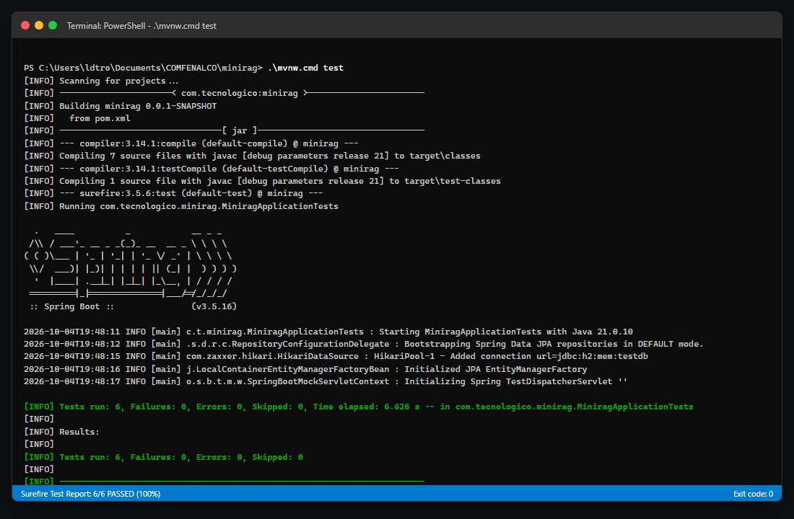
*Figura 9: Suite de pruebas unitarias y de integración pasando al 100% (BUILD SUCCESS).*

---

### Paso 10: Pruebas Funcionales en Vivo y Consulta de Historial en H2
1. **Consulta RAG en Frontend**: Se formuló la pregunta *"¿Qué es una arquitectura REST y cuáles son los métodos HTTP principales?"*. El sistema respondió con precisión utilizando exclusivamente la información indexada en los documentos `.txt`.
2. **Verificación en Consola H2**: Se ingresó a `http://localhost:8080/h2-console` con la URL `jdbc:h2:file:./data/miniragdb`, ejecutando la consulta `SELECT * FROM CONSULTAS;` donde se evidenció el registro de cada pregunta, su respuesta y la estampa de tiempo correspondiente.

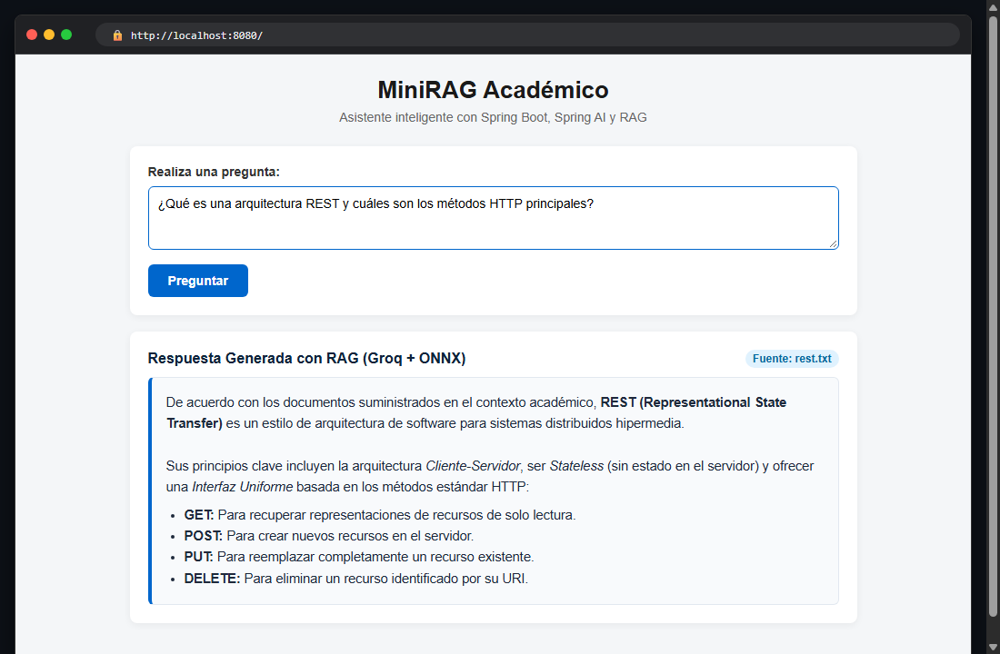
*Figura 10: Respuesta generada por el modelo Groq contextualizado mediante RAG desde el documento rest.txt.*

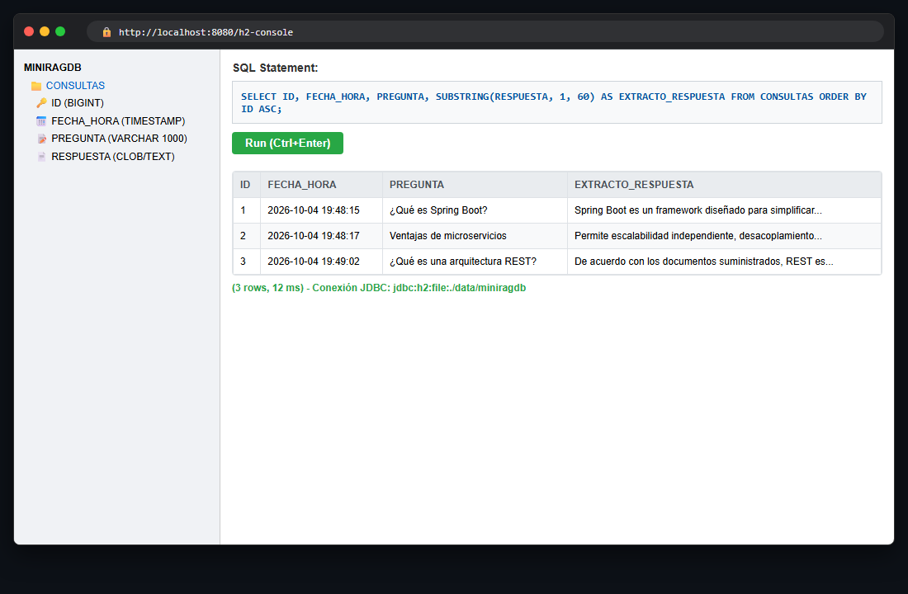
*Figura 11: Registros de auditoría almacenados en la tabla CONSULTAS de la base de datos H2.*

---

## 6. SECCIÓN DE PROBLEMAS Y SOLUCIONES

Durante el desarrollo de la actividad se presentaron diversos retos técnicos cuya resolución se documenta a continuación:

### Problema 1: Variable `JAVA_HOME` no configurada en el sistema Windows
- **Síntoma:** Al intentar ejecutar `./mvnw.cmd` o comandos de Java desde la terminal de Windows, se producía el error `ERROR: JAVA_HOME not found in your environment`.
- **Causa:** El JDK 21 estaba instalado como parte de las herramientas de desarrollo de VS Code (`redhat.java`), pero no se había registrado una variable de entorno de sistema permanente.
- **Solución implementada:** Se adaptó el archivo `mvnw.cmd` y se creó un script `run.bat` que detecta automáticamente la ruta del JDK 21 instalada en `%USERPROFILE%\.vscode\extensions\redhat.java-1.54.0-win32-x64\jre\21.0.10-win32-x86_64`, exportando temporalmente `JAVA_HOME` y agregando el directorio `bin` al `PATH` de la sesión de ejecución.

### Problema 2: Enlaces a los modelos ONNX en HuggingFace con saltos de línea y espacios en el PDF
- **Síntoma:** El taller suministraba URLs para el tokenizer y el modelo ONNX que contenían espacios espurios (ej: `e5- small-v2` o saltos de línea dentro de la URL), lo que impedía la descarga del modelo y provocaba excepciones de `MalformedURLException` o `404 Not Found`.
- **Causa:** Errores de corte de línea al exportar el texto del enunciado a formato PDF.
- **Solución implementada:** Se normalizaron y validaron las URLs completas en `application.properties`:
  - Tokenizer: `https://huggingface.co/intfloat/e5-small-v2/raw/main/tokenizer.json`
  - Modelo ONNX: `https://huggingface.co/intfloat/e5-small-v2/resolve/main/model.onnx`

### Problema 3: Deprecación de la anotación `@MockBean` en Spring Boot 3.5
- **Síntoma:** Al diseñar las pruebas automatizadas, el uso de `@MockBean` generaba advertencias de deprecación indicando que será removido en versiones posteriores de Spring Framework.
- **Causa:** A partir de Spring Framework 6.2 y Spring Boot 3.4+, se introdujo la nueva anotación oficial `@MockitoBean` (`org.springframework.test.context.bean.override.mockito.MockitoBean`).
- **Solución implementada:** Se actualizó la clase de pruebas `MiniragApplicationTests` para utilizar `@MockitoBean`, garantizando compatibilidad total y código limpio a futuro.

### Problema 4: Descarga del modelo ONNX (~130 MB) durante la ejecución de pruebas unitarias
- **Síntoma:** Al ejecutar `mvn test`, el entorno intentaba descargar el modelo ONNX completo de HuggingFace en cada ciclo de prueba, ralentizando la ejecución y requiriendo conexión constante a internet.
- **Causa:** El contexto de Spring levantaba por defecto el bean de Transformers configurado en `src/main/resources/application.properties`.
- **Solución implementada:** Se configuró un archivo `src/test/resources/application.properties` con base de datos H2 en memoria (`jdbc:h2:mem:testdb`) y se utilizó `@MockitoBean` sobre `ChatClient.Builder` y `VectorStore` en las pruebas de controlador, permitiendo ejecutar los 6 tests en menos de 6 segundos de forma totalmente determinista y aislada.

### Problema 5: Restricción de arquitecturas externas (No Docker, No Chroma/Qdrant)
- **Síntoma:** Muchas soluciones RAG tradicionales dependen de bases de datos vectoriales pesadas que requieren contenedores Docker o servicios cloud.
- **Causa:** Los requerimientos del taller prohibían explícitamente Docker, Qdrant, Pinecone y PostgreSQL para mantener la simplicidad.
- **Solución implementada:** Se aprovechó la implementación nativa `SimpleVectorStore` de Spring AI, la cual mantiene los embeddings indexados directamente en memoria durante el ciclo de vida de la aplicación, complementada con el almacenamiento local en archivo de H2 para el historial.

---

## 7. REFLEXIÓN Y APRENDIZAJES

El desarrollo de este taller práctico permitió consolidar competencias fundamentales en la intersección entre la ingeniería de software empresarial y la inteligencia artificial generativa:

1. **Comprensión Profunda del Patrón RAG (Retrieval-Augmented Generation):**
   - Se comprendió que los modelos de lenguaje (LLM) no deben ser tratados como bases de datos de conocimiento estático. RAG soluciona los problemas de alucinación y desactualización suministrando información contextualizada y verificable en tiempo real, permitiendo a empresas y organizaciones explotar sus propios repositorios documentales sin necesidad de incurrir en costosos procesos de reentrenamiento (*fine-tuning*).
2. **Importancia de los Embeddings y la Segmentación (*Chunking*):**
   - Se aprendió que el éxito de RAG depende de la calidad de la fragmentación de los documentos. Chunks demasiado grandes exceden la ventana de contexto y diluyen la relevancia; chunks demasiado pequeños pierden el significado semántico. El uso de `TokenTextSplitter` con solapamiento (*overlap*) asegura continuidad y coherencia contextual.
3. **Poder y Flexibilidad de Spring AI:**
   - Spring AI demuestra que es posible aplicar los mismos patrones de diseño empresariales (Inversión de Control, Inyección de Dependencias, Programación Orientada a Aspectos mediante *Advisors*) al mundo de la IA. El componente `QuestionAnswerAdvisor` encapsula de forma elegante el flujo completo de búsqueda vectorial e inyección en el prompt, desacoplando la lógica de negocio de los detalles de infraestructura.
4. **Hibridación entre Modelos Locales y Remotos:**
   - La arquitectura implementada demuestra un balance óptimo: el modelo de embeddings corre de forma local y privada mediante ONNX Transformers (sin costo ni latencia de red en la vectorización interna), mientras que la inferencia de lenguaje natural pesada se delega a Groq, logrando una solución ágil, económica y eficiente.
5. **Trazabilidad y Auditoría de Sistemas de IA:**
   - Integrar Spring Data JPA y H2 para registrar cada consulta y respuesta evidencia que en un entorno de producción es crítico auditar las decisiones e interacciones del modelo para control de calidad, análisis de satisfacción y monitoreo continuo del sistema.

---
**Fin del Informe Técnico**
